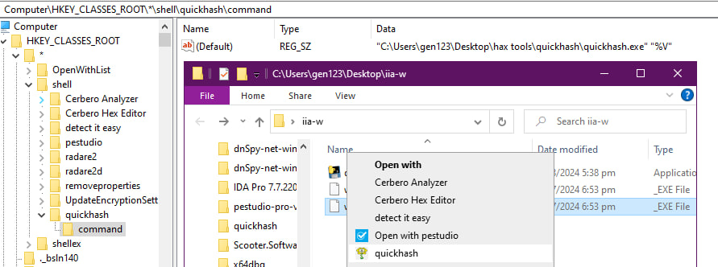

# QuickHash

A quick tool to enhance malware triage analysis to get hashes (MD5, SHA1, SHA256, ImpHash and TLSH)


## Installation
```
pip install -r requirements
```

## Usage
```bash
> python quickhash.py $sample

File: sample._exe
MD5, SHA1, SHA256, Imphash, TLSH
37812<REDACTED>f21
685ac<REDACTED>43123b2
81b04<REDACTED>101d798f7
53260<REDACTED>d33
t1a72<REDACTED>359


PRESS ENTER KEY TO EXIT, C TO COPY HASHES TO CLIPBOARD
Hashes copied to clipboard!
Exiting...
```

## Compiling using PyInstaller
```bash
> pyinstaller --onefile --icon=flowey.ico quickhash.py
503 INFO: PyInstaller: 6.10.0, contrib hooks: 2024.8
503 INFO: Python: 3.11.7
528 INFO: Platform: Windows-10-10.0.22631-SP0
529 INFO: Python environment: c:\Users\Analyst\Documents\ma\tools\quickhash\env
532 INFO: wrote C:\Users\Analyst\Documents\ma\tools\quickhash\quickhash.spec
...
...
17474 INFO: Copying bootloader EXE to C:\Users\Analyst\Documents\ma\tools\quickhash\dist\quickhash.exe
17484 INFO: Copying icon to EXE
17494 INFO: Copying 0 resources to EXE
17494 INFO: Embedding manifest in EXE
17503 INFO: Appending PKG archive to EXE
17519 INFO: Fixing EXE headers
17773 INFO: Building EXE from EXE-00.toc completed successfully.
```

A single file `quickhash.exe` will be created in the `/dist` folder

## Adding Quickhash to Context Menu in Windows

1. Navigate to `HKCR\*\shell` in regedit
2. Add a new key `quickhash`
3. (Optional) if you want to add logo to the context menu, add a `String Value` and rename it as `Icon`. Change the value to point to the `.ico` file of your choosing
4. Add a new subkey and name it `command`
5. Change the (Default) string value to point to the `quickhash.exe` full path with a commandline argument `"%V"` to allow `quickhash.exe` to receive an argument of the target file

